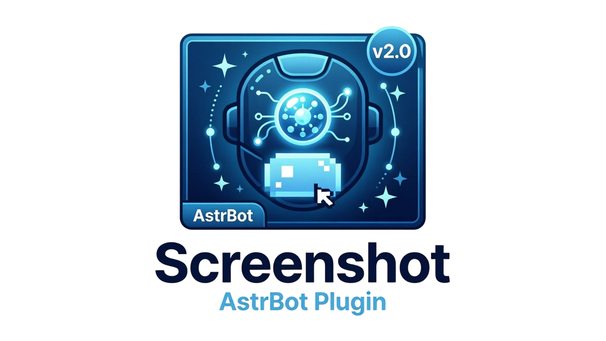
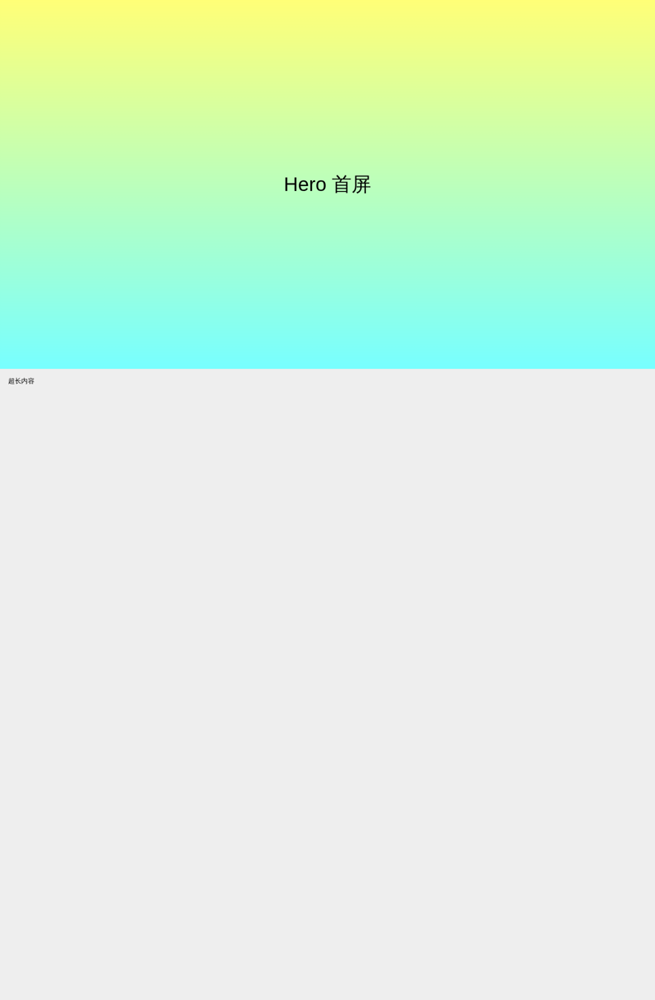

<div align="center">



<sub>商店头像：<a href="logo.png"><code>logo.png</code></a>（256×256 透明 PNG，只用图标本体）</sub>

# Screenshot

**新一代非 API 接口的 AstrBot 截图插件**

说 Chrome DevTools Protocol，不说 Playwright / Selenium / html2image

[](https://github.com/techjiang/astrbot-plugin-Screenshot/releases)


[功能](#功能) · [安装](#安装) · [用法](#用法) · [参数表](#参数表) · [配置](#配置) · [文档](docs/) · [常见问题](docs/FAQ.md)

</div>

---

## Logo 资源

| 文件 | 尺寸 | 用途 |
| --- | --- | --- |
| `logo.png` | 256×256 | **AstrBot 实际读取的插件 Logo**，必须是这个路径（见下） |
| `assets/logo.png` | 256×256 | 与根目录同源同内容，供文档与仓库页引用 |
| `assets/logo-256.png` | 256×256 | 同 `logo.png`，供需要固定文件名的场景引用 |
| `assets/logo-512.png` | 512×512 | 高清头像（文档站、活动页） |
| `assets/logo-128.png` | 128×128 | 小尺寸头像 |
| `assets/icon-96.png` | 96×96 | 方形 favicon（主体裁得更紧，48px 以下仍能看清） |
| `assets/logo-banner.png` | 1280×720 | README 顶部横幅（图标 + 标题 + 副标题） |
| `.cnb/logo.png` | 128×128 | CNB 仓库页面图标 |

### Logo 路径是有讲究的：必须在插件根目录

AstrBot 只在**插件目录根**按固定文件名找 Logo，源码里就是一句：

```python
self.logo_fname = "logo.png"
logo_path = os.path.join(plugin_dir_path, self.logo_fname)
if os.path.exists(logo_path):
    metadata.logo_path = logo_path
```

所以：

- 根目录**必须**有 `logo.png`。放成 `assets/logo.png` 不会被读到 —— 此时
  `metadata.logo_path` 是 `None`，WebUI 与商店卡片只能回落到官方默认图标，
  **表现就是「怎么改 Logo 都不显示」**。
- `metadata.yaml` 里的 `logo:` 字段不是 AstrBot 的读取来源（它是提交商店时的描述字段），
  改它不会让头像生效。
- `tests/test_metadata.py` 会硬性校验根目录 `logo.png` 存在、且与 `assets/logo.png`
  逐字节一致，防止有人「整理目录」把它挪走。同时 `.gitignore` 里为它单独放行
  （`*/png` 全局忽略 + `!/logo.png`），否则它会被静默排除、压根不进仓库。

图标本体均从 `assets/logo-banner.png` 里按固定裁切框现裁，不再让同一张图被不同尺寸重复缩放：
不同前端拿到的都是「够满」的方形画布，缩到 24–48px 时主体占比仍然够大。

源图是作者提供的一张 1024×1024 无背景整图（图标 + 两行标题）。**头像与横幅是两种用途，
不要混用**：商店头像只取图标本体，因为列表里只有 40px 上下，塞进标题文字会糊成一片；
整行标题留给横幅。

```bash
python tests/test_metadata.py    # 校验头像几何、alpha、以及「缩到 64px / 32px 是否还看得清」
```

## 这是什么

一个 QQ / 微信 / Telegram 里发指令就出图的 AstrBot 插件：

```
/截图 https://cnb.cool                 → 整页长图
/截图 example.com #main                → 只截某个元素
/渲染截图 <h1>签到成功 ✅</h1>          → 把 HTML 渲染成图
/截图 example.com format=pdf           → 长文档直接出 PDF
```

## 为什么是「非 API 接口」

它不调用 Playwright、Selenium、html2image 这类浏览器封装库，而是直接说
CDP（Chrome DevTools Protocol）—— 用 WebSocket 把 `Page.navigate`、
`Page.captureScreenshot`、`Emulation.setDeviceMetricsOverride` 这些浏览器内核
原生命令发下去。

| 传统做法 | 问题 | 本插件的做法 |
| --- | --- | --- |
| Playwright / Selenium | 需要匹配浏览器与驱动版本，升级即崩 | 只依赖 CDP 协议，浏览器大版本升级照常工作 |
| html2image / wkhtmltoimage | 自带一套旧内核，CSS 支持落后 | 用的是同一个 Chromium，渲染结果与真机一致 |
| 各类截图 API 服务 | 需要外网、要 key、有配额、有隐私风险 | 全程本地进程内完成，不出网、无配额 |

CDP 是浏览器自带的调试协议，只要进程带着 `--remote-debugging-port` 起来就能用。
插件只用到命令行 + HTTP + WebSocket 三样东西，没有版本漂移。

## 功能

- **四类截图**：整页长图 / 可视区 / 元素截图 / HTML 片段渲染
- **三种输出**：PNG、JPEG（可调质量）、PDF（长文档多页，不受聊天平台压图影响）
- **透明背景**：`transparent` 出真正的 RGBA PNG，适合截 Logo、图标、无背景组件
- **设备模拟**：`desktop` / `laptop` / `iphone` / `android` / `pad`，也可直接写 `1440x900`
- **渲染细节**：暗色模式、`@media print` 分支、`scale=` 倍率、`wait=` 等元素、`waitms=` 固定延迟
- **出图净化**：`hide=` 隐藏广告浮层、`watermark=` 打水印、`padding=` 给元素留白
- **超长页面**：自动分条截取再拼接，长图按 `max_height` 均衡切片，不会被聊天平台拒收
- **稳**：浏览器崩溃自动重启重试、截到纯色空白图自动重试、并发闸门、缓存自动清理

## 安装

在 AstrBot 插件市场搜索 `Screenshot` 安装，或把仓库放进插件目录：

```
astrbot/data/plugins/astrbot_plugin_screenshot/
```

插件需要一个系统里的 Chromium / Chrome。Debian / Ubuntu：

```bash
apt-get update && apt-get install -y chromium fonts-noto-cjk fonts-noto-color-emoji
```

> **中文字体一定要装**，否则图里的中文会变成方框 □□□，emoji 也会丢。

插件会按 `chromium` → `chromium-browser` → `google-chrome` → `msedge` 的顺序自动
探测，探不到时才需要在配置里显式填 `browser_path`。

## 用法

```
/截图 <网址>                      整页长图
/截图 <网址> viewport             只截可视区
/截图 <网址> #main .card          截指定元素（等价于 /元素截图）
/截图 <网址> iphone scale=2       指定设备与缩放倍率
/截图 <网址> dark                 暗色模式
/截图 <网址> transparent          透明背景
/截图 <网址> hide=.ad,.float      截图前隐藏干扰元素
/截图 <网址> watermark=科技酱      右下角打水印
/截图 <网址> wait=.loaded         等元素出现后再截
/截图 <网址> format=pdf           输出多页 PDF
/元素截图 <网址> <CSS选择器>       元素截图
/渲染截图 <h1>你好</h1>            直接渲染 HTML 片段
/截图帮助                         查看用法
```

参数可以任意组合、顺序无关。裸 token 会依次充当网址与选择器：

```
/截图 example.com "#main > .card"      # 选择器带空格时用引号包起来
/截图 example.com selector=#main       # 与上面等价
```

值里要带空格或引号时用引号包起来，内部引号用反斜杠转义：

```
/截图 example.com watermark="科技酱 \"官方\""
```

## 参数表

### 模式

| 参数 | 说明 |
| --- | --- |
| `full`（默认） | 整页长图 |
| `viewport` | 只截当前可视区（首屏） |
| `#id` / `.cls` / `div > p` | 元素截图（也可写 `selector=`） |
| `render` | 渲染模式（一般用 `/渲染截图`） |
| `print` | 切到页面的 `@media print` 分支（站点自己的打印样式） |

### 设备与缩放

| 参数 | 说明 | 默认 |
| --- | --- | --- |
| `desktop` | 1600×1000，DPR 1 | ✅ |
| `laptop` | 1280×800，DPR 2 | |
| `iphone` | 390×844，DPR 3，移动端 | |
| `android` | 412×915，DPR 3，移动端 | |
| `pad` | 834×1112，DPR 2，移动端 | |
| `1440x900` | 直接指定 CSS 视口尺寸（内部按 DPR 2 渲染，出图仍是 1440×900） | |
| `scale=2` / `2x` | 在设备 DPR 之上再放大，范围 0.2–4 | `1` |
| `mobile=true` | 覆盖设备预设的移动端标记 | 跟随预设 |

设备也认中文别名：`电脑` `pc`、`笔记本`、`手机`、`平板` / `ipad`。

### 页面处理

| 参数 | 说明 | 默认 |
| --- | --- | --- |
| `wait=.cls` | 等该选择器出现后再截，超时按 `timeout=` | — |
| `waitms=800` | 固定延迟毫秒（0–60000） | `0` |
| `hide=.a,.b` | 截图前把这些选择器 `display:none` | — |
| `watermark=文本` | 右下角水印；整页贴图底、元素贴元素右下角 | — |
| `padding=24` | 元素截图向外留白，用来容下 `box-shadow` / `outline` | `0` |
| `transparent` | 保留页面透明背景（PNG 带 alpha） | `false` |
| `dark=true` / `light` | 模拟 `prefers-color-scheme` | `false` |
| `timeout=30000` | 导航与等页面稳定的超时毫秒（1000–600000） | `20000` |

### 输出

| 参数 | 说明 | 默认 |
| --- | --- | --- |
| `format=png\|jpeg\|pdf` | 输出格式，`jpg` 等价 `jpeg` | `png` |
| `quality=80` | JPEG 质量（10–100） | `88` |
| `max_height=6000` | 单张图片最大高度，超出自动切片；`0` 表示本次不切 | 跟随配置 |

> 越界参数会被自动夹取到合理区间，不会静默失败也不会报错；
> 解析不了的取值会回退到默认值。

## 渲染 HTML

`/渲染截图` 接受 HTML 片段，插件会自动补上 `<!doctype html>` 骨架、中文字体栈
与图片自适应样式；贴完整文档（`<!doctype` / `<html` 开头）则原样渲染。

```
/渲染截图 <div style="padding:24px">签到成功 ✅</div>
/渲染截图 html:<!doctype html><html><body>...</body></html>
/渲染截图 <h1>你好</h1> dark 1080x720
```

## 配置

在 AstrBot 插件配置面板里改，或直接改 `data/config/astrbot_plugin_screenshot_config.json`。

| 键 | 类型 | 说明 | 默认 |
| --- | --- | --- | --- |
| `browser_path` | string | Chromium 可执行文件路径，留空自动探测 | `""` |
| `launch_flags` | list | 追加到浏览器启动命令的参数 | `["--disable-features=Translate", "--autoplay-policy=no-user-gesture-required"]` |
| `proxy` | string | 浏览器出网代理，支持 `http://` 与 `socks5://`，可带 `user:pass@` | `""` |
| `headers` | text | 附加到所有请求的 HTTP 头，每行一条，如 `Cookie: a=b` | `""` |
| `max_concurrent` | int | 同时进行的截图上限（1–16），超出自动排队 | `4` |
| `max_dpr` | float | 大图自动降 DPR 的上限，`0` 表示不降 | `0` |
| `max_height` | int | 单张图片最大高度，超出自动切片，`0` 表示不切 | `6000` |
| `image_format` | string | 默认输出格式：`png` / `jpeg` | `png` |
| `jpeg_quality` | int | JPEG 质量（10–100） | `88` |
| `device` | string | 默认设备预设 | `desktop` |
| `full_page` | bool | 默认是否整页截图 | `true` |
| `dark` | bool | 默认是否暗色模式 | `false` |
| `timeout_ms` | int | 默认导航超时（毫秒） | `20000` |
| `transparent` | bool | 默认保留透明背景 | `false` |
| `padding` | int | 元素截图默认向外留白像素数 | `0` |
| `render_watch_ms` | int | 截图前观察 DOM 变化的窗口（毫秒），兜住 `setTimeout` 后才挂图/改版的页面 | `250` |

### 配置示例

```json
{
  "browser_path": "/usr/bin/chromium",
  "device": "iphone",
  "max_height": 4000,
  "image_format": "jpeg",
  "jpeg_quality": 82,
  "render_watch_ms": 600,
  "headers": "Cookie: sid=xxx\nAccept-Language: zh-CN,zh;q=0.9"
}
```

## 行为说明

- **整页图过高会自动切片**：默认 6000px 一段，按片数**均分**（末片不会只剩几十像素）；
  切片后仍超体积预算时重编码为 JPEG；`transparent` 的图不会被降级成 JPEG。
- **超长页分条截取**：单张位图高度有上限，超过时分条截取再纵向拼接，
  每条都把视口底对齐到该条底部，所以 `position:fixed` 的浮层只出现在图底。
- **浏览器进程常驻**：插件加载时启动一次 Chromium，每次截图新开一个标签页、用完即关，
  插件卸载时统一回收。进程假死或崩溃会自动重启并重试。
- **缓存自动清理**：产物写在 `data/plugin_data/astrbot_plugin_screenshot/cache`，
  最多保留 120 个文件，本次刚写出的产物受保护不会被误删。
- **首次使用有冷启动**：约 1–2 秒，之后单次截图通常在 1 秒内。
- **出图像素 = 你指定的视口像素**：`/截图 example.com viewport 1280x800` 出图就是
  1280×800。设备预设（`desktop`/`iphone` 等）自带 DPR 语义，出图会按预设的 DPR 放大。

## 效果

| 整页长图 | HTML 渲染 |
| --- | --- |
|  |  |

## 目录结构

```
main.py              插件入口、指令注册、产物落盘
core/browser.py      Chromium 进程管理 + CDP 连接收发（无 API 层）
core/session.py      导航、等渲染、四类截图、分段拼接、水印与透明
core/config.py       指令串分词与参数归一
core/image.py        切片、重编码、PDF 分页、HTML 骨架包装
tests/               e2e 实测（真 AstrBot + 真 Chromium）与解析回归
docs/                使用文档、开发文档、常见问题
```

## 开发与测试

```bash
# 指令解析回归（不需要浏览器）
python3 tests/test_parse.py

# 文档与代码一致性检查（参数、配置键、帮助文本）
python3 tests/test_docs.py

# 端到端实测：真 PluginManager 加载插件 → 真 Chromium 出图（40 条用例）
export ASTRBOT_ROOT=/tmp/ab
mkdir -p $ASTRBOT_ROOT/data/plugins $ASTRBOT_ROOT/data/config
ln -sfn "$PWD" $ASTRBOT_ROOT/data/plugins/astrbot_plugin_screenshot
printf '{}' > $ASTRBOT_ROOT/data/config/astrbot_plugin_screenshot_config.json
SHOT_BROWSER=$(which chromium) python3 tests/e2e_astrbot.py
```

详见 [开发文档](docs/DEVELOPMENT.md)。

## 文档

- [使用文档](docs/USAGE.md) —— 全部参数、组合示例、效果对比
- [开发文档](docs/DEVELOPMENT.md) —— 架构、CDP 调用细节、踩坑记录、测试与发布
- [常见问题](docs/FAQ.md) —— 装不上、出图方框、超时、白图怎么排查
- [更新日志](CHANGELOG.md)

## License

MIT
